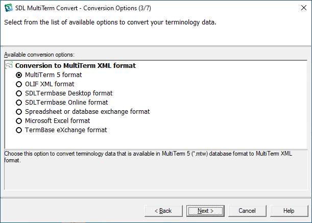

# Introduction

## What is MultiTerm Convert?

MultiTerm Convert is a standalone wizard application that was designed to convert legacy data such as Excel spreadsheets, semi-colon delimited files, etc. into MultiTerm XML format (MTF). At the time of writing MultiTerm Convert was delivered with three conversion options:

* Conversion of the old MultiTerm 5 format (\*.mtw files) into MTF
* Conversion of spreadsheet/database exchange formats (.e.g \*.csv) into MTF
* Conversion of Microsoft Excel spreadsheets into MTF
* Conversion of SDL Termbase and SDL Termbase Online into MTF
* Conversion of OLIF lexicons into MTF
* Conversion of TBX files into MTF

All conversion options are implemented as plug-ins, which are located in the **Plugins **sub-folder of the MultiTerm Convert installation directory, usually *C:\Program Files\SDL\SDL MultiTerm\MultiTerm8\Convert\Plugins*. Upon startup of MultiTerm Convert the application scans the **Plugins **sub-folder for any \*.dll libraries that implement a particular set of interfaces. If a \*.dll is found to implement the required interfaces, it is recognized as a MultiTerm Convert plug-in, and will consequently be listed on the "Available conversion options" screen.

## Setting-up a New Project

First create a new Class Library project in MS Visual Studio. The sample plug-in will be implemented in C#. You need to add the following references to your project:

* Trados.MultiTerm.Builders.dll
* Trados.MultiTerm.Conversion.Api.dll
* Trados.MultiTerm.Plugins.dll
* Trados.MultiTerm.Utility.dll
* Trados.MultiTerm.Wizard.dll

You can find these libraries in the MultiTerm Convert installation path, usually *C:\Programme\TRADOS\MultiTerm\MultiTermConvert*.

